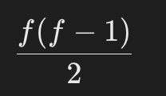

giải thích:

- 1 cặp (i, j) được gọi là 1 cặp tốt nếu giá trị của i bằng giá trị của j và phần tử của i nằm ở vị trí nhỏ hơn phần tử của j
- ví dụ:

```
Input: nums = [1,2,3,1,1,3]
Output: 4
Explanation: There are 4 good pairs (0,3), (0,4), (3,4), (2,5) 0-indexed
```

- ví dụ trên có nghĩa là chúng ta có 4 cặp giá trị tốt
- (0, 3): có nghĩa là phần tử thứ 0 (được gọi là i) và phần tử thứ 3 (được gọi là j)
- và cứ thế tương tự với các cặp này (0,4), (3,4), (2,5)

---

1. **Nested Loop**

- compare every pair `(i, j)` where `i < j`
- time complexity: `O(n^2)` (nested loop)

```
package main

import (
	"fmt"
)

func numIdenticalPairs(nums []int) int {
	count := 0
	n := len(nums)

	for i := 0; i < n-1; i++ {
		for j := i + 1; j < n; j++ {
			if nums[i] == nums[j] {
				count++
			}
		}
	}
	return count
}

func main() {
	nums := []int{1, 2, 3, 1, 1, 3}
	fmt.Println("Total Good Pairs:", numIdenticalPairs(nums))
}

```

2. **optimized approach (using hash map)**

- store frequency of each number in a map
- if a number appears `f` time, the number of pairs is:
  - 
- time complexity: `O(n)` (single pass)

```
package main

import (
	"fmt"
)

func numIdenticalPairs(nums []int) int {
	freq := make(map[int]int)
	count := 0

	for _, num := range nums {
		count += freq[num] // Add existing pairs
		freq[num]++        // Increment frequency
	}

	return count
}

func main() {
	nums := []int{1, 2, 3, 1, 1, 3}
	fmt.Println("Total Good Pairs:", numIdenticalPairs(nums)) // Output: 4
}

```
