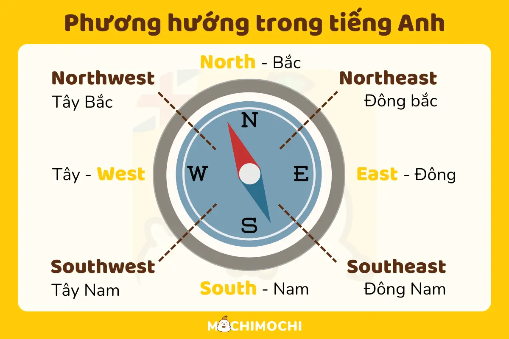

# LeetCode 1496: Path Crossing

## Problem Description

Given a string `path` where each character is 'N', 'S', 'E', or 'W', representing a move of one unit north, south, east, or west, respectively. Starting at the origin `(0, 0)` on a 2D plane, follow the path and determine if it crosses itself at any point (i.e., revisits a previously visited location). Return `true` if the path crosses itself, `false` otherwise.

### Constraints

- `1 <= path.length <= 10^4`
- `path[i]` is either 'N', 'S', 'E', or 'W'.
- Input is guaranteed to be valid.

### Examples

- **Example 1** :
- Input: `path = "NES"`
- Output: `false`
- Explanation: The path does not revisit any point.
- **Example 2** :
- Input: `path = "NESWW"`
- Output: `true`
- Explanation: The path revisits the origin `(0, 0)`.

## Approach

To solve the problem:

1. Track visited points using a set to store coordinates.
2. Start at the origin `(0, 0)` and mark it as visited.
3. Process each direction in the path, updating coordinates accordingly.
4. Check if the new point was visited before; if so, return `true`.
5. If no points are revisited, return `false`.

## Giải thích thuật toán cốt lõi (bằng tiếng Việt)

Thuật toán cốt lõi dựa trên việc theo dõi các điểm đã đi qua trên mặt phẳng 2D và kiểm tra xem có điểm nào được thăm lại hay không. Dưới đây là các bước chi tiết:

1. **Khởi tạo tập hợp điểm đã thăm** :

- Tạo một tập hợp (set) để lưu trữ tọa độ các điểm đã đi qua, sử dụng định dạng `(x, y)` hoặc chuỗi `"x,y"`.
- Điểm xuất phát `(0, 0)` được thêm vào tập hợp ngay từ đầu.
- Ví dụ: Trong Go, dùng `map[[2]int]bool`; trong Java/TypeScript, dùng `Set` với tọa độ dạng chuỗi.

2. **Xử lý từng hướng di chuyển** :

- Duyệt qua từng ký tự trong chuỗi `path`. Mỗi ký tự đại diện cho một hướng:
  - 'N': Tăng `y` lên 1 (di chuyển lên ↑).
  - 'S': Giảm `y` xuống 1 (di chuyển xuống ↓).
  - 'E': Tăng `x` lên 1 (di chuyển sang phải →).
  - 'W': Giảm `x` xuống 1 (di chuyển sang trái ←).
- Sau mỗi di chuyển, cập nhật tọa độ `(x, y)`.

3. **Kiểm tra điểm đã thăm** :

- Sau khi cập nhật tọa độ, kiểm tra xem tọa độ mới `(x, y)` có trong tập hợp điểm đã thăm hay không.
- Nếu có, đường đi đã cắt nhau (trả về `true`).
- Nếu không, thêm tọa độ mới vào tập hợp và tiếp tục.

4. **Kết quả** :

- Nếu duyệt hết chuỗi mà không có điểm nào được thăm lại, trả về `false`.

### Minh họa với ví dụ

- **Ví dụ 1** : `path = "NES"`:
- Bắt đầu: `(0, 0)` ⭐, thêm vào tập hợp.
- 'N': `(0, 1)` ↑, chưa thăm → thêm.
- 'E': `(1, 1)` →, chưa thăm → thêm.
- 'S': `(1, 0)` ↓, chưa thăm → thêm.
- Kết quả: `false` (không có điểm nào được thăm lại).
- **Ví dụ 2** : `path = "NESWW"`:
- Bắt đầu: `(0, 0)` ⭐, thêm vào tập hợp.
- 'N': `(0, 1)` ↑, chưa thăm → thêm.
- 'E': `(1, 1)` →, chưa thăm → thêm.
- 'S': `(1, 0)` ↓, chưa thăm → thêm.
- 'W': `(0, 0)` ←, đã thăm → trả về `true`.
- Kết quả: `true` (đường đi quay lại `(0, 0)`).

## Complexity Analysis

- **Time Complexity** : O(n), where `n` is the length of `path`:
- Iterate through the path: O(n).
- Set operations (add/check): O(1) average case.
- **Space Complexity** : O(n), for storing up to `n` points in the set.

## Implementation Notes

- Solutions are implemented in Go, Java, and TypeScript, all using the same core algorithm.
- Code is formatted with **2-space indentation** .
- Comments are in English, with a header explaining the logic and a visual example using arrows (↑, ↓, →, ←).
- No logging is included since the problem doesn't require it, but can be added for debugging.

## Conclusion

The algorithm efficiently tracks visited points using a set and checks for revisits after each move. By maintaining a set of coordinates, it detects path crossings in linear time, making it suitable for the given constraints.
