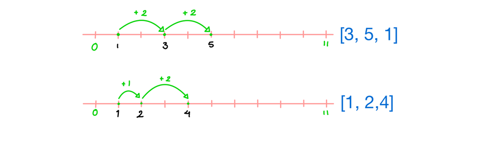

# LeetCode 1502: Can Make Arithmetic Progression From Sequence

## Problem Description

Given an array of integers `arr`, determine if it can be rearranged to form an arithmetic progression, where the difference between consecutive elements is constant. Return `true` if possible, `false` otherwise.

### Constraints

- `2 <= arr.length <= 1000`
- `-10^6 <= arr[i] <= 10^6`
- Input is guaranteed to be valid, so no error handling is needed.

### Examples

- **Example 1** :
- Input: `arr = [3, 5, 1]`
- Output: `true`
- Explanation: Can be rearranged as `[1, 3, 5]` (difference 2) or `[5, 3, 1]` (difference -2).
- **Example 2** :
- Input: `arr = [1, 2, 4]`
- Output: `false`
- Explanation: Cannot be rearranged to form an arithmetic progression.

## Approach

To solve the problem:

1. Sort the array to arrange elements in ascending order for easy difference checking.
2. Calculate the difference between the first two elements.
3. Verify if the difference between all consecutive elements is the same.
4. Return `true` if all differences are equal, `false` otherwise.

## Giải thích thuật toán cốt lõi (bằng tiếng Việt)

Thuật toán cốt lõi dựa trên việc sắp xếp mảng và kiểm tra tính chất của dãy số cộng. Dưới đây là cách hoạt động từng bước:

1. **Sắp xếp mảng** :

- Để kiểm tra dãy số cộng, ta cần các phần tử được sắp xếp tăng dần. Điều này đảm bảo rằng nếu mảng có thể tạo thành dãy số cộng, các phần tử liên tiếp sẽ có hiệu số cố định.
- Ví dụ: Với `arr = [3, 5, 1]`, sau khi sắp xếp ta được `[1, 3, 5]`.

1. **Tính hiệu số chuẩn** :

- Lấy hiệu số giữa hai phần tử đầu tiên của mảng đã sắp xếp: `diff = arr[1] - arr[0]`.
- Ví dụ: Với `[1, 3, 5]`, `diff = 3 - 1 = 2`.

1. **Kiểm tra hiệu số** :

- Duyệt qua mảng từ phần tử thứ 2 đến cuối, tính hiệu số giữa mỗi cặp phần tử liên tiếp (`arr[i] - arr[i-1]`).
- So sánh với `diff`. Nếu có bất kỳ hiệu số nào khác `diff`, mảng không thể là dãy số cộng, trả về `false`.
- Ví dụ: Với `[1, 3, 5]`, kiểm tra:
  - `arr[2] - arr[1] = 5 - 3 = 2` (bằng `diff`, tiếp tục).
  - Không có hiệu số nào khác, trả về `true`.

1. **Trả về kết quả** :

- Nếu tất cả hiệu số đều bằng `diff`, trả về `true`, nghĩa là mảng có thể được sắp xếp thành dãy số cộng.
- Nếu không, trả về `false`.

### Minh họa với ví dụ

- **Ví dụ 1** : `arr = [3, 5, 1]`:
- Sắp xếp: `[1, 3, 5]`.
- Tính `diff = arr[1] - arr[0] = 3 - 1 = 2`.
- Kiểm tra: `arr[2] - arr[1] = 5 - 3 = 2` (bằng `diff`).
- Kết quả: `true` (có thể sắp xếp thành `[1, 3, 5]` với hiệu số 2).
- **Ví dụ 2** : `arr = [1, 2, 4]`:
- Sắp xếp: `[1, 2, 4]`.
- Tính `diff = arr[1] - arr[0] = 2 - 1 = 1`.
- Kiểm tra: `arr[2] - arr[1] = 4 - 2 = 2` (khác `diff = 1`).
- Kết quả: `false` (không thể tạo dãy số cộng).

## Complexity Analysis

- **Time Complexity** : O(n log n), where `n` is the length of `arr`:
- Sorting the array: O(n log n).
- Checking differences: O(n).
- Overall: O(n log n) due to the sorting step.
- **Space Complexity** : O(1) or O(n), depending on the language:
- Go (`sort.Ints`): O(1) for in-place sorting.
- Java/TypeScript: May require O(n) for auxiliary space in sorting.

## Implementation Notes

- Solutions are implemented in Go, Java, and TypeScript, all using the same core algorithm.
- Code is formatted with **2-space indentation** as requested.
- No detailed logging is included since the problem doesn't require it, but it can be added for debugging.
- Comments in the code are written in English as per the latest request.

## Conclusion

The algorithm is simple and efficient, relying on sorting the array and checking for consistent differences. By ensuring a constant difference between consecutive elements, we can determine if the array can form an arithmetic progression. The solution handles all valid inputs as per the problem constraints.
