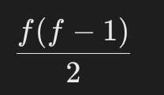

# **Giải thích 1512:**

- 1 cặp (i, j) được gọi là 1 cặp tốt nếu giá trị của i bằng giá trị của j và phần tử của i nằm ở vị trí nhỏ hơn phần tử của j
- ví dụ:

```bash
Input: nums = [1,2,3,1,1,3]
Output: 4
Explanation: There are 4 good pairs (0,3), (0,4), (3,4), (2,5) 0-indexed
```

- ví dụ trên có nghĩa là chúng ta có 4 cặp giá trị tốt
- (0, 3): có nghĩa là phần tử thứ 0 (được gọi là i) và phần tử thứ 3 (được gọi là j)
- và cứ thế tương tự với các cặp này (0,4), (3,4), (2,5)

---

1. **Nested Loop**

- compare every pair `(i, j)` where `i < j`
- time complexity: `O(n^2)` (nested loop)

```go
package main

import (
	"fmt"
)

func numIdenticalPairs(nums []int) int {
	count := 0
	n := len(nums)

	for i := 0; i < n-1; i++ {
		for j := i + 1; j < n; j++ {
			if nums[i] == nums[j] {
				count++
			}
		}
	}
	return count
}

func main() {
	nums := []int{1, 2, 3, 1, 1, 3}
	fmt.Println("Total Good Pairs:", numIdenticalPairs(nums))
}

```

2. **optimized approach (using hash map)**

- store frequency of each number in a map
- if a number appears `f` time, the number of pairs is:
  - 
- time complexity: `O(n)` (single pass)

```go
package main

import (
	"fmt"
)

func numIdenticalPairs(nums []int) int {
	freq := make(map[int]int)
	count := 0

	for _, num := range nums {
		count += freq[num] // Add existing pairs
		freq[num]++        // Increment frequency
	}

	return count
}

func main() {
	nums := []int{1, 2, 3, 1, 1, 3}
	fmt.Println("Total Good Pairs:", numIdenticalPairs(nums)) // Output: 4
}

```

## Code in video

### Template Code

- time complexity: **O(n)**

```go
func numIdenticalPairs_2(nums []int) int {
    result := 0
    numberCountMap := make(map[int]int) // O(1) average lookup time

    for i := 0; i < len(nums); i++ { // O(n) loop
        count, isExist := numberCountMap[nums[i]] // O(1) average lookup time
        if isExist {
            result += count // O(1) addition operation
            numberCountMap[nums[i]] = count + 1 // O(1) update operation
        } else {
            numberCountMap[nums[i]] = 1 // O(1) initialization
        }
    }
    return result // O(1)
}
```

Let's take `nums = [1, 2, 3, 1, 1, 3]` and go step by step:

| i   | nums[i] | numberCountMap Before | count, isExist | result Update | numberCountMap After |
| --- | ------- | --------------------- | -------------- | ------------- | -------------------- |
| 0   | 1       | {}                    | 0, false       | 0             | {1: 1}               |
| 1   | 2       | {1: 1}                | 0, false       | 0             | {1: 1, 2: 1}         |
| 2   | 3       | {1: 1, 2: 1}          | 0, false       | 0             | {1: 1, 2: 1, 3: 1}   |
| 3   | 1       | {1: 1, 2: 1, 3: 1}    | 1, true        | 1             | {1: 2, 2: 1, 3: 1}   |
| 4   | 1       | {1: 2, 2: 1, 3: 1}    | 2, true        | 1 + 2 = 3     | {1: 3, 2: 1, 3: 1}   |
| 5   | 3       | {1: 3, 2: 1, 3: 1}    | 1, true        | 3 + 1 = 4     | {1: 3, 2: 1, 3: 2}   |

**Final Output**

- `result = 4`, which matches the expected output!

### **Explanation:**

When iterating through the array, we use a **hash map** to keep track of the count of each number. Let's go step by step:

1. **First number = 1**
   - Not in the map → Goes to `else` → Add **1** to the map with count **1** .
2. **Second number = 2**
   - Not in the map → Goes to `else` → Add **2** to the map with count **1** .
3. **Third number = 3**
   - Not in the map → Goes to `else` → Add **3** to the map with count **1** .
4. **Fourth number = 1**
   - Found **1** in the map (appeared once before).
   - Goes to `if` → **Update result** : `result = 0 + 1 = 1`.
   - Increase the count of **1** in the map → **Now count of 1 = 2** .
5. **Fifth number = 1**
   - Found **1** in the map (appeared **2** times before).
   - Goes to `if` → **Update result** : `result = 1 + 2 = 3`.
   - Increase the count of **1** in the map → **Now count of 1 = 3** .
6. **Sixth number = 3**
   - Found **3** in the map (appeared **1** time before).
   - Goes to `if` → **Update result** : `result = 3 + 1 = 4`.
   - Increase the count of **3** in the map → **Now count of 3 = 2** .

### **Final Result:**

The total number of **good pairs** in the array is **4** .

---

### **Key Takeaways:**

- The **hash map** keeps track of the count of each number.
- Each time we find a number that already exists in the map, we **add its previous count to the result** .
- The result grows as **more pairs are formed** .
- **Final answer = 4 good pairs.** ✅
